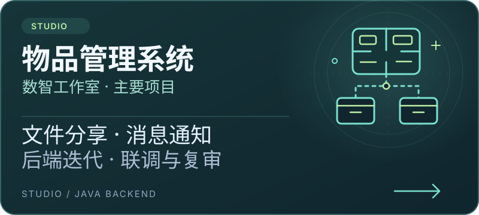
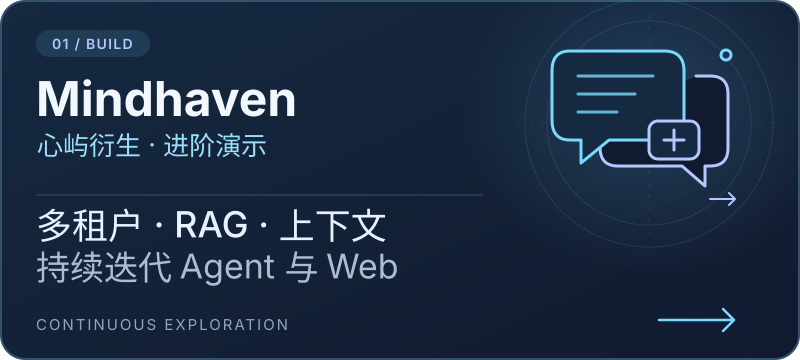
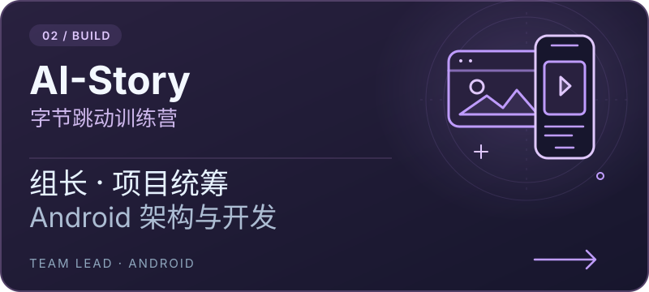
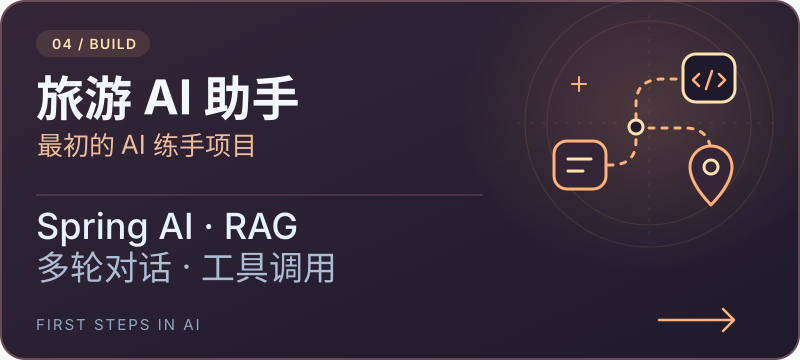
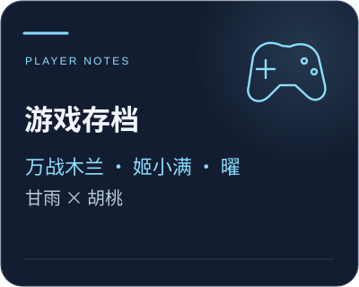
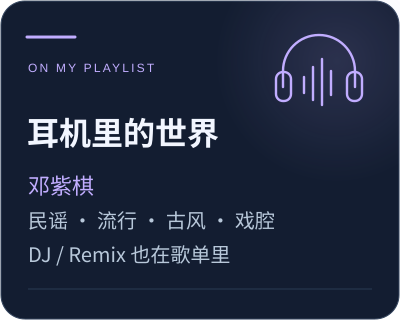
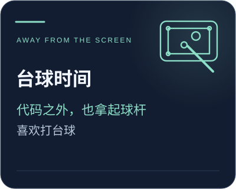
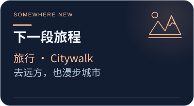

  

<h1 align="center">Hi 👋, I'm Yihao Zhang · 十曜金乌</h1>

<b>Software Engineering · Class of 2027 · Guangdong University of Technology</b> Java Backend · AI Applications · AI-Assisted Full-Stack Development

Building with my campus studio, learning through internships. Off the clock: music, pool, travel, and city walks.

  
  
  
  

## 🧭 A Little About Me

- At **Tianyuan Dike**, I worked on ticketing, broadcast control, and operations tools. At **Xiaohongshu**, I contributed to AI-assisted internationalization checks, platform development, and SDK compatibility.
- A member of **Shuzhi Studio** at my university's School of Computer Science. I led **AI-Story** at a ByteDance training camp, coordinating the team and developing the Android client.
- Currently building **Mindhaven**, exploring agents, and learning web development with AI assistance.

## ✨ Selected Projects

**Inventory Management** is Shuzhi Studio's main project, maintained by successive student teams. **Mindhaven** builds on **Xinyu (心屿)** as a web demo.

  
  

  
  

## 🧰 Tech Stack

**Backend & AI**

      

    

**Web & Mobile**

    

     

**Tools & Deployment**

    

Some I've used in projects; others I'm still exploring.

## 📓 Learning Along the Way

I follow problems into the code and keep notes on debugging, trade-offs, and integration.

<b>A few lessons from internships and campus life</b>

- **Check what actually runs.** An AI SDK integration compiled after dependency changes but failed at startup because of an existing RPC middleware conflict. I built a lightweight model client and tool-calling loop for that use case, limiting the upgrade scope while taking responsibility for the protocol, timeouts, and stopping conditions.
- **Compare local and CI environments.** When an SDK change passed locally but failed in CI, I traced the JDK, Maven, submodule, and dependency requirements. I compared upgrading dependencies with keeping a compatible version.
- **Look beyond the model call.** Moving from a Skill prototype to a Java service, I contributed to rule-based filtering, model judgments, code search when needed, and storing results for review. Tool budgets, concurrency, failure handling, and low-confidence results became part of the work too.

**Campus & Teamwork**

I assisted a student affairs counselor and served as deputy head of external relations for our Youth League committee. Studio work, training camps, and coursework taught me how to share responsibilities, communicate, and see projects through.

For a software engineering course, I proposed **SparrowShortLink** and led the team, handling coordination and deployment.

## 🎧 Beyond Code

  
  

  
  

🎶 Three picks from my playlist: **《唯一》 · 《画心》 · 《牵丝戏》**. I'd love to hear what you're listening to.

<a href="https://github.com/shiyaojinwu"><b>Find me on GitHub ↗</b></a>

